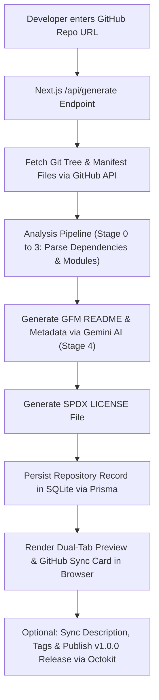

# ReadmeForge

<p align="center">
  <b>Enterprise Readme & License Generator with GitHub Metadata Automation</b><br>
  Analyzes GitHub repositories via Git Trees API, parses multi-ecosystem manifests, generates grounded README.md & SPDX LICENSE files using Google Gemini AI, and syncs metadata to GitHub via Octokit.
</p>

<p align="center">
  <a href="https://github.com/Bavly-Hamdy/ReadmeForge"></a>
  <a href="https://github.com/Bavly-Hamdy/ReadmeForge"></a>
  <a href="https://github.com/Bavly-Hamdy/ReadmeForge"></a>
  <a href="https://github.com/Bavly-Hamdy/ReadmeForge"></a>
  <a href="https://github.com/Bavly-Hamdy/ReadmeForge"></a>
  <a href="LICENSE"></a>
</p>

---

## 📋 Table of Contents
- [Overview](#overview)
- [Key Features](#key-features)
- [How It Works](#how-it-works)
- [System Architecture](#system-architecture)
- [API Reference](#api-reference)
- [Database Schema](#database-schema)
- [Project Anatomy](#project-anatomy)
- [Installation & Setup](#installation--setup)
- [Author](#author)
- [License](#license)

---

## Overview

**ReadmeForge** is a full-stack Next.js 14 web application designed to generate detailed, repository-grounded `README.md` documentation and `LICENSE` files for software projects.

Instead of cloning full repositories onto local disk, ReadmeForge fetches file trees and key manifests directly from GitHub using the **GitHub REST API**. It analyzes package structure, scripts, environment variables, and module code, then dispatches structured prompts to **Google Gemini AI** to build production-ready documentation and automated GitHub releases.

---

## Key Features

1. **Progress-Fill Button & Stepper UX:**
   - Interactive submit button with an animated progress bar ($0\%$ to $100\%$), active stage label, and timer counter.
   - 5-stage drawer showcasing real-time execution stages.

2. **Multi-Ecosystem Manifest Parsing:**
   - Detects and parses `package.json` (Node.js), `pyproject.toml` / `requirements.txt` / `Pipfile` / `uv.lock` (Python), `Cargo.toml` (Rust), `go.mod` (Go), `pom.xml` / `build.gradle` (Java), and `.env.example`.
   - Generates ecosystem-aware installation & execution commands (e.g. `uv sync`, `pip install`, `npm run dev`, `cargo run`).

3. **Enterprise SaaS Document Generator:**
   - Structured 14-section format: Title, Overview, Flowcharts (Mermaid.js SVG), Technology Table, Installation, Project Tree, Module Walkthroughs, API Matrix / CLI Script Matrix, Security Isolation, Deployment Matrix, Contributors, and License.
   - Enforces strict factual grounding rules to eliminate robotic placeholders.

4. **SPDX License Generator & Owner Auto-Detection:**
   - Automatically extracts the GitHub repository owner name.
   - Offers customizer inputs for Author Name, Copyright Year, and License Type (MIT, Apache-2.0, GPL-3.0).
   - Generates standalone SPDX `LICENSE` files and renders a Rights & Permissions matrix table (`🟢 Permissions`, `🟡 Conditions`, `🔴 Limitations`).
   - Dual-tab preview (`README.md` | `LICENSE`) with single-file and combined ZIP download options.

5. **GitHub Metadata Auto-Sync & v1.0.0 Release Engine:**
   - Updates GitHub repository Description, Website URL, and Topics/Tags using Octokit.
   - Publishes official tagged `v1.0.0` Production Releases on GitHub with AI-generated release notes.

6. **Rate-Limit Aware Tree Fetcher:**
   - Probes `HEAD` $\rightarrow$ `main` $\rightarrow$ `master` branches directly via GitHub Trees API.
   - Uses parallel blob fetching for authenticated OAuth sessions and throttled requests for anonymous visitors.

---

## How It Works



---

## System Architecture

The application is structured into three primary layers:

1. **Frontend Presentation (React & Next.js App Router):**
   - Built with Next.js 14, TypeScript, Tailwind CSS, Framer Motion, and Zustand for state management.
   - Renders markdown with `react-markdown`, `remark-gfm`, `rehype-raw`, and client-side `mermaid` SVG diagrams.

2. **Backend Engine (Next.js Route Handlers):**
   - `/api/generate`: Runs the 5-stage analysis pipeline and Gemini AI synthesis.
   - `/api/github/sync-metadata`: Interacts with Octokit to update repo metadata and releases.
   - `/api/auth/[...nextauth]`: NextAuth.js GitHub OAuth authentication.

3. **Data Layer (Prisma ORM & SQLite):**
   - SQLite database (`dev.db`) storing user profiles, GitHub OAuth sessions, repositories, and generated README records.

---

## API Reference

### `POST /api/generate`
Analyzes a GitHub repository and generates `README.md`, `LICENSE`, and release metadata.

**Request Body:**
```json
{
  "repoUrl": "https://github.com/Bavly-Hamdy/ReadmeForge",
  "customTitle": "ReadmeForge SaaS",
  "demoUrl": "https://readmeforge.vercel.app",
  "teamName": "Core Engineering",
  "authorName": "Bavly Hamdy",
  "copyrightYear": "2026",
  "licenseType": "MIT",
  "includeLicense": true,
  "collaborators": []
}
```

**Response Payload (`200 OK`):**
```json
{
  "success": true,
  "markdown": "# ReadmeForge ...",
  "licenseContent": "MIT License\n\nCopyright (c) 2026 Bavly Hamdy ...",
  "suggestedDescription": "Enterprise Readme & License Generator with GitHub Metadata Automation.",
  "suggestedTopics": ["nextjs", "typescript", "gemini-ai", "developer-tools"],
  "releaseNotes": "## 🚀 v1.0.0 Production Release ...",
  "digest": { ... },
  "commitSha": "8f4d2bb"
}
```

---

### `POST /api/github/sync-metadata`
Updates repository metadata and publishes an official release on GitHub.

**Request Body:**
```json
{
  "repoUrl": "https://github.com/Bavly-Hamdy/ReadmeForge",
  "description": "Enterprise Readme & License Generator for software codebases.",
  "homepage": "https://readmeforge.vercel.app",
  "topics": ["nextjs", "typescript", "developer-tools"],
  "publishRelease": true,
  "releaseNotes": "## 🚀 v1.0.0 Release Notes ...",
  "tagName": "v1.0.0"
}
```

**Response Payload (`200 OK`):**
```json
{
  "success": true,
  "message": "GitHub Repository metadata synced successfully!",
  "updated": {
    "owner": "Bavly-Hamdy",
    "repo": "ReadmeForge",
    "description": "Enterprise Readme & License Generator...",
    "homepage": "https://readmeforge.vercel.app",
    "topics": ["nextjs", "typescript", "developer-tools"]
  },
  "release": {
    "id": 1428579,
    "html_url": "https://github.com/Bavly-Hamdy/ReadmeForge/releases/tag/v1.0.0"
  }
}
```

---

## Database Schema

Defined in `prisma/schema.prisma`:

```prisma
model User {
  id            String       @id @default(cuid())
  name          String?
  email         String?      @unique
  image         String?
  username      String?
  githubId      String       @unique
  createdAt     DateTime     @default(now())
  updatedAt     DateTime     @updatedAt
  accounts      Account[]
  sessions      Session[]
  repositories  Repository[]
}

model Repository {
  id            String            @id @default(cuid())
  owner         String
  name          String
  fullName      String            @unique
  defaultBranch String            @default("main")
  userId        String
  user          User              @relation(fields: [userId], references: [id], onDelete: Cascade)
  readmes       GeneratedReadme[]
  createdAt     DateTime          @default(now())
  updatedAt     DateTime          @updatedAt
}

model GeneratedReadme {
  id           String     @id @default(cuid())
  repositoryId String
  repository   Repository @relation(fields: [repositoryId], references: [id], onDelete: Cascade)
  persona      String
  content      String
  createdAt    DateTime   @default(now())
}
```

---

## Project Anatomy

```text
ReadmeForge/
├── app/
│   ├── api/
│   │   ├── auth/[...nextauth]/     # NextAuth.js authentication
│   │   ├── generate/              # Main README generation API
│   │   └── github/sync-metadata/  # GitHub metadata & release sync API
│   ├── globals.css                # Global CSS & theme variables
│   ├── layout.tsx                 # Root layout & providers
│   └── page.tsx                   # Dashboard main page
├── components/
│   ├── dashboard/
│   │   ├── generator-form.tsx     # Form, progress bar, & stepper drawer
│   │   └── github-sync-card.tsx   # Metadata sync & release card
│   └── editor/
│       ├── mermaid-diagram.tsx    # Mermaid SVG renderer
│       └── readme-preview.tsx     # Dual-tab preview & download actions
├── lib/
│   ├── ai/gemini.ts               # Gemini AI generation & prompt rules
│   ├── github/
│   │   ├── metadata.ts            # Octokit metadata & release functions
│   │   ├── octokit.ts             # Octokit client factory
│   │   └── tree.ts                # Git tree fetcher & throttler
│   ├── license/mit.ts             # SPDX MIT License generator
│   └── store/use-readme-store.ts  # Zustand store
├── prisma/
│   └── schema.prisma              # SQLite database schema
├── worker/
│   └── pipeline.ts                # 5-stage analysis pipeline
├── .env.example                   # Environment variable template
├── package.json                   # Dependencies and npm scripts
└── README.md                      # Project documentation
```

---

## Installation & Setup

### Prerequisites
- Node.js >= 18.0.0
- npm or pnpm

### 1. Clone the Repository
```bash
git clone https://github.com/Bavly-Hamdy/ReadmeForge.git
cd ReadmeForge
```

### 2. Configure Environment Variables
Create a `.env` file in the root folder:
```env
# Database & Gemini Credentials
DATABASE_URL="file:./dev.db"
GEMINI_API_KEY="your_google_gemini_api_key"

# Optional Server-Side GitHub Token
GITHUB_TOKEN="your_github_personal_access_token"

# GitHub OAuth Setup (NextAuth.js)
GITHUB_CLIENT_ID="your_github_client_id"
GITHUB_CLIENT_SECRET="your_github_client_secret"
NEXTAUTH_SECRET="your_nextauth_secret_key"
NEXTAUTH_URL="http://localhost:3000"
```

### 3. Install Dependencies
```bash
npm install
```

### 4. Setup Database
```bash
npx prisma db push
```

### 5. Run Development Server
```bash
npm run dev
```
Open [http://localhost:3000](http://localhost:3000) in your browser.

---

## Author

**Bavly Hamdy** — Lead Developer & Creator  
- GitHub: [@Bavly-Hamdy](https://github.com/Bavly-Hamdy)

---

## License

This project is licensed under the [MIT License](LICENSE).

Copyright (c) 2026 Bavly Hamdy
