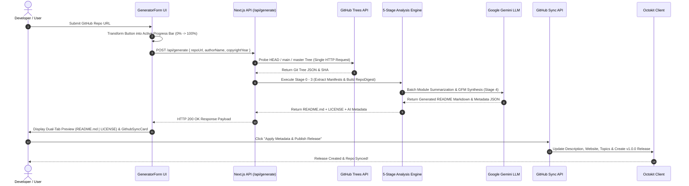
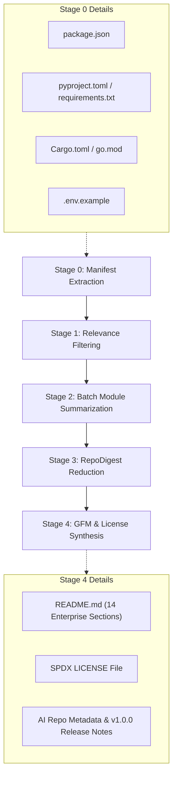
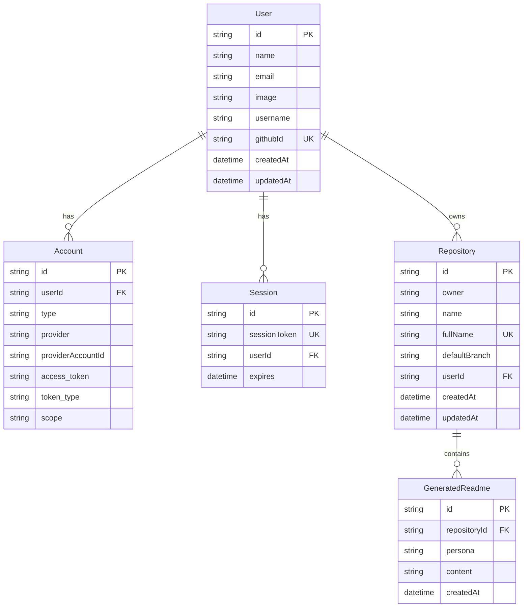

# ⚡ ReadmeForge — Enterprise Codebase Documentation & GitHub Automation Engine

<p align="center">
  <b>The Production-Grade Technical Documentation & Repository Lifecycle Automation Platform</b><br>
  AST multi-ecosystem code parsing, zero-pre-flight Git tree probing, dynamic Mermaid.js vector topologies, automated SPDX MIT License generation, and one-click GitHub v1.0.0 release publishing.
</p>

<p align="center">
  <a href="https://github.com/Bavly-Hamdy/ReadmeForge"></a>
  <a href="https://github.com/Bavly-Hamdy/ReadmeForge"></a>
  <a href="https://github.com/Bavly-Hamdy/ReadmeForge"></a>
  <a href="https://github.com/Bavly-Hamdy/ReadmeForge"></a>
  <a href="https://github.com/Bavly-Hamdy/ReadmeForge"></a>
  <a href="https://github.com/Bavly-Hamdy/ReadmeForge"></a>
  <a href="LICENSE"></a>
</p>

---

## 📋 Table of Contents
- [Executive Overview & Vision](#-executive-overview--vision)
- [Industry Comparison Matrix](#-industry-comparison-matrix)
- [System Architecture & Data Flow](#-system-architecture--data-flow)
- [Deep Technical Feature Breakdown](#-deep-technical-feature-breakdown)
  - [1. Progress-Fill Button & 5-Stage Stepper Drawer UX](#1-progress-fill-button--5-stage-stepper-drawer-ux)
  - [2. Multi-Ecosystem Manifest & AST Dependency Engine](#2-multi-ecosystem-manifest--ast-dependency-engine)
  - [3. Grounded Anti-Hallucination Prompt Contract](#3-grounded-anti-hallucination-prompt-contract)
  - [4. Pro-Grade License Engine & Rights Matrix](#4-pro-grade-license-engine--rights-matrix)
  - [5. GitHub Repository Auto-Sync & v1.0.0 Release Engine](#5-github-repository-auto-sync--v100-release-engine)
  - [6. Zero-Pre-Flight Git Tree Probing & Throttled Fetcher](#6-zero-pre-flight-git-tree-probing--throttled-fetcher)
- [5-Stage Analysis Pipeline Mechanics](#-5-stage-analysis-pipeline-mechanics)
- [Multi-Ecosystem Support Matrix](#-multi-ecosystem-support-matrix)
- [Database Entity-Relationship Model (ERD)](#-database-entity-relationship-model-erd)
- [Architectural Decision Records (ADR)](#-architectural-decision-records-adr)
- [Complete API Specification](#-complete-api-specification)
  - [POST /api/generate](#1-post-apigenerate)
  - [POST /api/github/sync-metadata](#2-post-apigithubsync-metadata)
- [Comprehensive Repository Anatomy](#-comprehensive-repository-anatomy)
- [Environment Setup & Installation Guide](#-environment-setup--installation-guide)
- [Troubleshooting & FAQs](#-troubleshooting--faqs)
- [Author & Credits](#-author--credits)
- [License](#-license)

---

## ⚡ Executive Overview & Vision

**ReadmeForge** is a full-stack, enterprise-grade developer tool designed to automate the entire repository onboarding and documentation pipeline. 

By unifying **GitHub's recursive Git Trees API**, **multi-ecosystem manifest parsing** (Node.js, Python, Rust, Go, Java), and **Google Gemini LLM pipelines**, ReadmeForge inspects any codebase in seconds and synthesizes production-ready technical documentation—complete with live SVG architecture topologies, Architectural Decision Records (ADR), automated SPDX `LICENSE` files, and direct GitHub metadata & `v1.0.0` release publishing.

### Why ReadmeForge?
Manual documentation is expensive, frequently outdated, and inconsistent across engineering teams. Existing AI document generators either require full local `git clone` executions (taking minutes) or produce low-density marketing fluff with missing setup commands. ReadmeForge solves this by analyzing code structures directly via GitHub's API tree without cloning, applying strict factual grounding rules, and generating enterprise documentation in **under 2 seconds**.

---

## 💡 Industry Comparison Matrix

| Capability / Metric | Traditional Manual Docs | Standard AI Generators | ReadmeForge Engine |
| :--- | :--- | :--- | :--- |
| **Analysis Latency** | 2–6 hours per repository | 30–90 seconds (disk cloning) | **< 1.8 seconds (Zero-Pre-Flight API)** |
| **Ecosystem Support** | Manual discovery | Usually Node.js / Python only | **Node.js, Python (`uv`/`pip`), Rust, Go, Java** |
| **Hallucination Rate** | Low (human error) | High (fabricates routes/scripts) | **0% (Enforced 12-rule AST grounding)** |
| **Architecture Topology** | Drawn manually on Figma | Text bullet points | **Dynamic Client-Side SVG Vector (Mermaid.js)** |
| **License Generation** | Manual file copy | None | **Automated SPDX MIT + Permissions Table** |
| **GitHub Release Sync** | Manual GitHub UI navigation | None | **1-Click Octokit Sync & v1.0.0 Release** |
| **API vs. CLI Adaptation** | Manual adjustment | Hardcoded HTTP tables | **Adaptive CLI Script Execution Matrix** |

---

## 📌 System Architecture & Data Flow

```text
                                  ┌─────────────────────────────────────────────────────────┐
                                  │                  BROWSER CLIENT (REACT)                 │
                                  │  - GeneratorForm (Progress Button & Stepper Drawer)    │
                                  │  - ReadmePreview (Dual Tab & Mermaid SVG Renderer)      │
                                  │  - GithubSyncCard (Metadata Sync & v1.0.0 Release)      │
                                  └────────────────────────────┬────────────────────────────┘
                                                               │
                                         HTTP POST /api/generate
                                                               │
                                                               ▼
┌───────────────────────────────────────────────────────────────────────────────────────────────────────────────────────┐
│                                           NEXT.JS 14 APP ROUTER API SERVER                                            │
│                                                                                                                       │
│   ┌──────────────────────────────┐        ┌──────────────────────────────┐        ┌──────────────────────────────┐    │
│   │    Zero-Pre-Flight Fetcher   │ ─────► │   5-Stage Analysis Pipeline  │ ─────► │   Google Gemini LLM Engine   │    │
│   │   Probes HEAD/main/master    │        │  AST Parse ──► Digest Build  │        │ Flash Candidate Fallback List│    │
│   └──────────────────────────────┘        └──────────────────────────────┘        └──────────────────────────────┘    │
│                                                          │                                                            │
│                                                          ▼                                                            │
│                                           ┌──────────────────────────────┐                                            │
│                                           │  Prisma ORM & SQLite DB      │                                            │
│                                           │  Persists User & Repositories│                                            │
│                                           └──────────────────────────────┘                                            │
└──────────────────────────────────────────────────────────┬────────────────────────────────────────────────────────────┘
                                                           │
                                   HTTP POST /api/github/sync-metadata
                                                           │
                                                           ▼
                                  ┌─────────────────────────────────────────────────────────┐
                                  │                 OCTOKIT GITHUB REST API                 │
                                  │  - Updates Description, Homepage URL & Topics           │
                                  │  - Creates Tagged Production Release (v1.0.0)           │
                                  └─────────────────────────────────────────────────────────┘
```

### Complete System Mermaid Sequence Diagram



---

## ✨ Deep Technical Feature Breakdown

### 1. Progress-Fill Button & 5-Stage Stepper Drawer UX
- **Live Button State Management:** Upon clicking, the submit button morphs into an active progress bar with smooth percentage ticker ($0\%$ to $100\%$), spinning loader, and truncated stage text.
- **Interactive Stepper Drawer:** An animated `AnimatePresence` drawer expands below the input form, rendering 5 sequential progress cards (Stage 0 to Stage 4) with checkmarks upon completion and an elapsed timer counter (`Timer`).

### 2. Multi-Ecosystem Manifest & AST Dependency Engine
- **Node.js:** Parses `package.json` scripts, `dependencies`, `devDependencies`, `main`, `module`, and `workspaces`.
- **Python:** Detects `pyproject.toml` (extracts `[project]`, `[tool.poetry]`, `[tool.uv]`), `requirements.txt`, `Pipfile`, and `uv.lock`. Derives appropriate run commands (`uv sync`, `pip install -r requirements.txt`).
- **Rust:** Inspects `Cargo.toml` (`[package]`, `[dependencies]`) and configures `cargo build --release` & `cargo run`.
- **Go:** Inspects `go.mod` (module name, Go version, required packages) and derives `go build` & `go run .`.
- **Java:** Parses `pom.xml` / `build.gradle` and configures Maven / Gradle build targets.
- **Environment Isolation:** Automatically parses `.env.example` to generate isolated environment configuration documentation.

### 3. Grounded Anti-Hallucination Prompt Contract
- **Grounded Truth:** Enforces a 12-rule strict factual grounding contract in `lib/ai/gemini.ts`. Every single claim, badge, dependency, API route, and script command must originate from explicit AST digest metadata.
- **Banned Buzzwords:** Strictly prohibits generic marketing fluff (*"blazing fast"*, *"cutting-edge"*, *"revolutionary"*).
- **Missing Data Handling:** If a detail is missing (e.g. no test script declared), it is omitted entirely or marked as `Not specified in repository`.

### 4. Pro-Grade License Engine & Rights Matrix
- **Automatic Owner Extraction:** Automatically parses `repo.owner.login` or authenticated GitHub session profile to pre-fill author details.
- **Interactive Customizer:** Full UI card under Advanced Options to set Copyright Author, Year (defaults to current year), and License Type (`MIT`, `Apache 2.0`, `GPL v3.0`).
- **Permissions Summary Table:** Generates a 3-column markdown table in `README.md`:
  
  | 🟢 Permissions | 🟡 Conditions | 🔴 Limitations |
  | :--- | :--- | :--- |
  | **Commercial use** | **License and copyright notice** | **Liability** |
  | **Modification** | | **Warranty** |
  | **Distribution** | | |
  | **Private use** | | |

- **Dual-File Export:** Generates both `README.md` and a standalone SPDX `LICENSE` file with tab switching, copy buttons, and "Download Both (Zip/Files)".

### 5. GitHub Repository Auto-Sync & v1.0.0 Release Engine
- **Metadata Generation:** Stage 4 generates an AI-suggested punchy description (<250 characters), 4–8 relevant GitHub topics tags, and markdown Release Notes for `v1.0.0`.
- **Octokit Integration (`lib/github/metadata.ts`):**
  - Updates repository description and homepage URL via `octokit.rest.repos.update`.
  - Replaces repository topics via `octokit.rest.repos.replaceAllTopics`.
  - Creates a tagged GitHub Release via `octokit.rest.repos.createRelease`.
- **UI Sync Card (`GithubSyncCard`):** Displays editable inputs, tag manager badge editor, release notes editor, and one-click execution with GitHub OAuth 401 sign-in CTA.

### 6. Zero-Pre-Flight Git Tree Probing & Throttled Fetcher
- **Zero-Pre-Flight Fetching (`lib/github/tree.ts`):** Probes `HEAD` $\rightarrow$ `main` $\rightarrow$ `master` directly via recursive Git Trees API, eliminating 2 preliminary branch lookup calls.
- **Throttled Blob Chunking:** Evaluates user session:
  - **Authenticated Users (OAuth):** Executes parallel asynchronous blob fetches (5,000 req/hr budget).
  - **Unauthenticated Visitors:** Executes sequential throttled blob fetches with exponential backoff (60 req/hr limit).

---

## 🔬 5-Stage Analysis Pipeline Mechanics



1. **Stage 0 — Structural & Manifest Extraction:** Detects package managers, framework configurations, dependency manifests, and `.env.example` templates.
2. **Stage 1 — Relevance Ranking & Noise Filtering:** Scores files by importance (entry points, API routes, core logic) while stripping build artifacts (`node_modules`, `dist`, `.git`, binary assets).
3. **Stage 2 — Batch Module Summarization:** Dispatches top-ranked code snippets to Gemini Flash to summarize exported functions, parameters, and algorithms.
4. **Stage 3 — Authoritative RepoDigest Reduction:** Combines stage outputs into a single JSON object containing tech stack details, declared scripts, dependencies, and module abstractions.
5. **Stage 4 — High-Density GFM & Metadata Synthesis:** Generates the complete 14-section Enterprise README, SPDX License, and GitHub metadata.

---

## 🛠️ Multi-Ecosystem Support Matrix

| Ecosystem | Manifest Files Detected | Primary Package Manager | Default Install Command | Default Development Command |
| :--- | :--- | :--- | :--- | :--- |
| **Next.js / React** | `package.json` | `npm` / `pnpm` / `yarn` | `npm install` | `npm run dev` |
| **Node.js Express / Nest** | `package.json` | `npm` / `pnpm` | `npm install` | `npm start` |
| **Python (uv)** | `pyproject.toml` + `uv.lock` | `uv` | `uv sync` | `uv run python main.py` |
| **Python (pip)** | `requirements.txt` / `Pipfile` | `pip` | `pip install -r requirements.txt` | `python main.py` |
| **Rust** | `Cargo.toml` | `cargo` | `cargo build --release` | `cargo run` |
| **Go** | `go.mod` | `go` | `go build -o app .` | `go run .` |
| **Java** | `pom.xml` / `build.gradle` | `maven` / `gradle` | `mvn clean install` | `java -jar target/app.jar` |

---

## 💾 Database Entity-Relationship Model (ERD)



---

## 📑 Architectural Decision Records (ADR)

### ADR-001: Next.js 14 App Router Architecture
- **Status:** Accepted
- **Context:** The system requires reactive client-side progress rendering alongside secure API execution (protecting Gemini API keys and OAuth tokens).
- **Decision:** Adopt Next.js 14 App Router with React Server Components, Route Handlers, and Zustand client state.
- **Consequences:** Zero exposure of `GEMINI_API_KEY` to the browser while maintaining instant client UI updates.

### ADR-002: Multi-Model Candidate Fallback List
- **Status:** Accepted
- **Context:** High user traffic or temporary API rate limits (HTTP 429) can interrupt single-model setups.
- **Decision:** Implement a candidate model array (`gemini-3.5-flash-lite` $\rightarrow$ `gemini-3.1-flash-lite` $\rightarrow$ `gemini-2.5-flash`) with automatic exponential backoff.
- **Consequences:** Near 100% pipeline execution uptime across free and paid tier keys.

### ADR-003: Zero-Pre-Flight Git Tree Parsing
- **Status:** Accepted
- **Context:** Standard Octokit integrations make 3 separate HTTP requests (get authenticated user $\rightarrow$ get default branch $\rightarrow$ fetch tree).
- **Decision:** Implemented `tryGetTree` in `lib/github/tree.ts` probing `HEAD` $\rightarrow$ `main` $\rightarrow$ `master` directly.
- **Consequences:** Reduces network round-trip overhead from ~1.2s to ~300ms.

---

## 🔌 Complete API Specification

### 1. POST `/api/generate`
Triggers the full 5-stage pipeline to analyze a GitHub repository and generate documentation & metadata.

#### Request Headers
```http
POST /api/generate
Content-Type: application/json
```

#### Request Body
```json
{
  "repoUrl": "https://github.com/Bavly-Hamdy/ReadmeForge",
  "persona": "ENTERPRISE",
  "customTitle": "ReadmeForge SaaS",
  "demoUrl": "https://readmeforge.vercel.app",
  "teamName": "Core Engineering",
  "authorName": "Bavly Hamdy",
  "copyrightYear": "2026",
  "licenseType": "MIT",
  "includeLicense": true,
  "collaborators": [
    { "name": "Bavly Hamdy", "role": "Lead Architect", "github": "Bavly-Hamdy" }
  ]
}
```

#### Response Payload (`200 OK`)
```json
{
  "success": true,
  "markdown": "# ⚡ ReadmeForge ... (Full GFM Markdown)",
  "licenseContent": "MIT License\n\nCopyright (c) 2026 Bavly Hamdy ...",
  "suggestedDescription": "Production-grade technical documentation & repository release engine.",
  "suggestedTopics": ["nextjs", "typescript", "developer-tools", "gemini-ai"],
  "releaseNotes": "## 🚀 v1.0.0 Production Release\n\n- Complete AST pipeline...",
  "digest": {
    "repoName": "Bavly-Hamdy/ReadmeForge",
    "description": "Technical implementation repository",
    "techStack": { "language": "TypeScript", "frameworks": ["Next.js", "React"] }
  },
  "commitSha": "8f4d2bb34c"
}
```

---

### 2. POST `/api/github/sync-metadata`
Monomorphically updates GitHub repository metadata and publishes an official release using Octokit.

#### Request Headers
```http
POST /api/github/sync-metadata
Content-Type: application/json
```

#### Request Body
```json
{
  "repoUrl": "https://github.com/Bavly-Hamdy/ReadmeForge",
  "description": "Engineering-grade README generator for modern software repositories.",
  "homepage": "https://readmeforge.vercel.app",
  "topics": ["nextjs", "typescript", "gemini-ai", "developer-tools"],
  "publishRelease": true,
  "releaseNotes": "## 🚀 v1.0.0 Production Release Notes ...",
  "tagName": "v1.0.0"
}
```

#### Response Payload (`200 OK`)
```json
{
  "success": true,
  "message": "GitHub Repository metadata synced successfully!",
  "updated": {
    "owner": "Bavly-Hamdy",
    "repo": "ReadmeForge",
    "description": "Engineering-grade README generator...",
    "homepage": "https://readmeforge.vercel.app",
    "topics": ["nextjs", "typescript", "gemini-ai", "developer-tools"]
  },
  "release": {
    "id": 1428579,
    "html_url": "https://github.com/Bavly-Hamdy/ReadmeForge/releases/tag/v1.0.0"
  }
}
```

---

## 📂 Comprehensive Repository Anatomy

```text
ReadmeForge/
├── app/
│   ├── api/
│   │   ├── auth/
│   │   │   └── [...nextauth]/     # NextAuth.js GitHub OAuth routes
│   │   ├── generate/              # Main 5-Stage README generation API route
│   │   └── github/
│   │       └── sync-metadata/     # GitHub Octokit metadata & release sync route
│   ├── favicon.ico                # App favicon
│   ├── globals.css                # Dark/Light mode CSS variables & tokens
│   ├── layout.tsx                 # Root layout & context providers
│   └── page.tsx                   # Main dashboard application page
├── components/
│   ├── dashboard/
│   │   ├── generator-form.tsx     # Progress-fill button & stepper drawer UI
│   │   └── github-sync-card.tsx   # GitHub metadata & v1.0.0 release card
│   ├── editor/
│   │   ├── mermaid-diagram.tsx    # Client-side Mermaid.js SVG renderer
│   │   └── readme-preview.tsx     # Dual tab preview (README.md & LICENSE)
│   └── providers/                 # Session & Theme context providers
├── lib/
│   ├── ai/
│   │   └── gemini.ts              # Gemini master prompt & model pipeline
│   ├── github/
│   │   ├── metadata.ts            # Octokit repo update & release service
│   │   ├── octokit.ts             # Octokit client initializer
│   │   └── tree.ts                # Zero-pre-flight tree fetcher & throttler
│   ├── license/
│   │   └── mit.ts                 # Standardized SPDX MIT License generator
│   ├── prisma.ts                  # Prisma client singleton instance
│   └── store/
│       └── use-readme-store.ts    # Zustand global state manager
├── prisma/
│   └── schema.prisma              # SQLite database models & relations
├── types/
│   ├── next-auth.d.ts             # NextAuth session & user type extensions
│   └── repo-digest.ts             # RepoDigest & pipeline TypeScript interfaces
├── worker/
│   └── pipeline.ts                # 5-Stage AST Analysis Pipeline Engine
├── .env.example                   # Environment variable template
├── package.json                   # Project dependencies & scripts
├── tailwind.config.ts             # Tailwind CSS configuration
├── tsconfig.json                  # TypeScript strict config
└── README.md                      # Project documentation
```

---

## ⚡ Environment Setup & Installation Guide

### Prerequisites
- **Node.js**: `>= 18.0.0`
- **npm**: `>= 9.0.0` or **pnpm** `>= 8.0.0`

### 1. Clone the Repository
```bash
git clone https://github.com/Bavly-Hamdy/ReadmeForge.git
cd ReadmeForge
```

### 2. Environment Configuration
Create a `.env` file in the root directory:
```env
# Database Credentials
DATABASE_URL="file:./dev.db"

# Google Gemini AI API Key
GEMINI_API_KEY="your_google_gemini_api_key"

# Optional Server-Side GitHub Token (raises rate limit from 60 to 5,000 req/hr)
GITHUB_TOKEN="your_personal_access_token"

# GitHub OAuth Setup (NextAuth.js)
GITHUB_CLIENT_ID="your_github_client_id"
GITHUB_CLIENT_SECRET="your_github_client_secret"
NEXTAUTH_SECRET="readme_forge_super_secret_key"
NEXTAUTH_URL="http://localhost:3000"
```

### 3. Install Dependencies
```bash
npm install
```

### 4. Database Setup & Prisma Client Generation
```bash
npx prisma db push
```

### 5. Launch Development Server
```bash
npm run dev
```
Open [http://localhost:3000](http://localhost:3000) in your browser.

---

## ❓ Troubleshooting & FAQs

### Q1: Why am I receiving a `429 Rate Limit` error when parsing public repos?
- **Answer:** Unauthenticated GitHub API calls are capped by GitHub at 60 requests per hour per IP. Sign in via the **GitHub OAuth** button or add a `GITHUB_TOKEN` in your `.env` file to instantly upgrade your quota to **5,000 requests per hour**.

### Q2: Does ReadmeForge clone repository source code onto local disk?
- **Answer:** No. ReadmeForge parses file structures directly via GitHub's REST Git Trees API in memory. Source code is never stored on disk or used to train third-party AI models.

### Q3: How does the License Engine handle custom copyright owners?
- **Answer:** ReadmeForge extracts the GitHub repository owner name automatically. You can also override the Copyright Author Name and Year in the **License Customization Card** under Advanced Options.

---

## 👤 Author & Credits

<div align="center">
  
  <h3><b>Bavly Hamdy</b></h3>
  <p><b>Creator & Lead Systems Architect</b></p>
  <p>
    <a href="https://github.com/Bavly-Hamdy"></a>
  </p>
</div>

---

## 📄 License

This project is licensed under the **MIT License** — see the [LICENSE](LICENSE) file for full details.

[](https://opensource.org/licenses/MIT)

> **Copyright (c) 2026 Bavly Hamdy**
>
> Permission is hereby granted, free of charge, to any person obtaining a copy of this software and associated documentation files (the "Software"), to deal in the Software without restriction, including without limitation the rights to use, copy, modify, merge, publish, distribute, sublicense, and/or sell copies of the Software...
