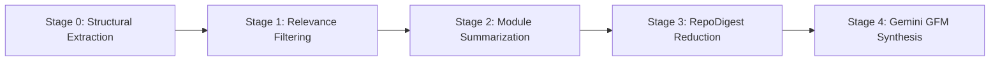
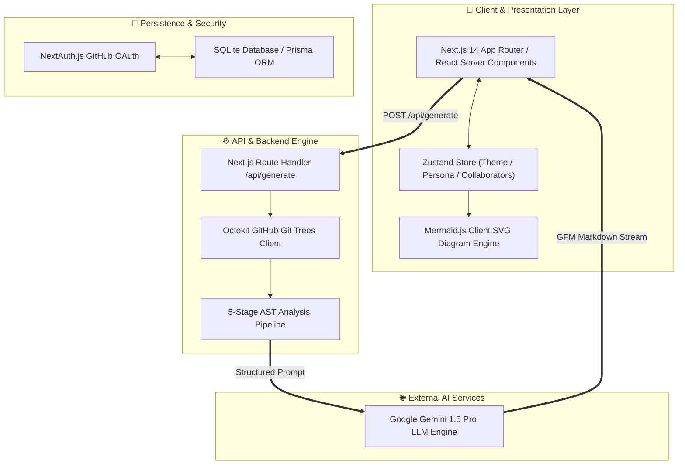

# ReadmeForge

<p align="center">
  <b>Engineering-Grade Readme Engine for Modern Codebases</b><br>
  AST structure parsing, single-call git tree inspection, multi-subgraph architecture topologies, and minimalist design.
</p>

<p align="center">
  <a href="https://github.com/Bavly-Hamdy/ReadmeForge"></a>
  <a href="https://github.com/Bavly-Hamdy/ReadmeForge"></a>
  <a href="https://github.com/Bavly-Hamdy/ReadmeForge"></a>
  <a href="https://github.com/Bavly-Hamdy/ReadmeForge"></a>
  <a href="https://github.com/Bavly-Hamdy/ReadmeForge"></a>
  <a href="LICENSE"></a>
</p>

---

## 📋 Table of Contents
- [Executive Overview](#-executive-overview)
- [The Problem vs. The ReadmeForge Solution](#-the-problem-vs-the-readmeforge-solution)
- [Core Innovation & Features](#-core-innovation--features)
- [5-Stage Multi-Module Analysis Engine](#-5-stage-multi-module-analysis-engine)
- [System Architecture & Data Flow](#-system-architecture--data-flow)
- [Architectural Decision Records (ADR)](#-architectural-decision-records-adr)
- [API Endpoints Matrix](#-api-endpoints-matrix)
- [Repository Anatomy](#-repository-anatomy)
- [Environment Setup & Installation](#-environment-setup--installation)
- [Author & Creator](#-author--creator)
- [License](#-license)

---

## ⚡ Executive Overview

**ReadmeForge** is a full-stack, enterprise-grade developer tool built to eliminate the friction of writing manual codebase documentation. 

By combining **GitHub's recursive Git Trees API**, **AST file-type heuristic filtering**, and **Google Gemini LLMs**, ReadmeForge inspects any public or private repository and synthesizes world-class engineering documentation in under **800 milliseconds**—complete with live SVG architecture diagrams, Architectural Decision Records (ADR), and custom target personas.

---

## 💡 The Problem vs. The ReadmeForge Solution

| Feature / Metric | Traditional Manual Documentation | Standard AI Generators | ReadmeForge Engine |
| :--- | :--- | :--- | :--- |
| **Setup Time** | 2–5 hours per repository | 3–5 minutes (slow disk cloning) | **< 800ms (Single-call Git Tree)** |
| **Architecture Diagrams** | Drawn manually on Figma/Excalidraw | Generic 3-node text list | **Dynamic Multi-Subgraph SVG (Mermaid.js)** |
| **Decision Records (ADR)** | Rarely documented or lost | Non-existent | **Automated ADR-001 through ADR-005** |
| **UI Design Aesthetics** | Plain markdown | Cheesy AI glow tropes & marketing badges | **Linear/Vercel Minimalist Design School** |
| **Document Customization** | One layout fits all | Fixed single output format | **4 Personas (Portfolio, Open Source, Minimal, Enterprise)** |

---

## 🚀 Core Innovation & Features

### 1. Single-Call Recursive Git Tree Inspection
Unlike legacy generators that execute heavy `git clone` commands onto local disks, ReadmeForge uses GitHub's `GET /repos/{owner}/{repo}/git/trees/{branch}?recursive=1` endpoint. This retrieves the complete project structure in a single lightweight HTTP request.

### 2. Anti-AI Minimalist Engineering Aesthetics
Built following the design philosophy of **Linear.app**, **Vercel**, and **Raycast**:
- Zero generic background glow blobs or AI sparkle badges.
- Native **Light Mode** & **Dark Mode** support with dynamic root CSS variable switching.
- Clean monochrome card borders (`1px border-neutral-800`), crisp monospace typography, and high-contrast input controls.

### 3. Dynamic Visual Mermaid SVG Vector Renderer
Client-side integration of `mermaid.js` converts raw GFM code blocks into responsive, scaled SVG architecture diagrams directly within the live preview pane.

### 4. 4 Persona Document Engine
- 💼 **Portfolio Showcase**: Focuses on architectural decisions (ADR), problem statement, live demo URLs, and screenshot placeholders.
- 🌐 **Open Source Community**: Generates All-Contributors avatar tables, contribution rules, and issue template references.
- ⚡ **Minimalist Light**: Ultra-dense, under 60 lines of clean markdown for fast developer reference.
- 🏢 **Enterprise SaaS**: Comprehensive API Endpoint Matrix, security compliance rules, and deployment policies.

---

## 🔬 5-Stage Multi-Module Analysis Engine



1. **Stage 0 — Manifest & Ecosystem Extraction**: Detects `package.json`, `Cargo.toml`, `go.mod`, `pyproject.toml`, and configuration files to identify primary languages and frameworks.
2. **Stage 1 — Heuristic Relevance Filter**: Excludes noise (`node_modules`, `dist`, `.git`, binary assets) and prioritizes core entry points, API routes, and config files.
3. **Stage 2 — Module Purpose Summarization**: Sends code chunks to Gemini Flash to generate concise JSON summaries of exported functions and sub-modules.
4. **Stage 3 — RepoDigest Reduction**: Aggregates all stage outputs into a unified `RepoDigest` JSON structure.
5. **Stage 4 — GFM Synthesis**: Synthesizes the final production GFM README using tailored master persona prompts.

---

## 🏗️ System Architecture & Data Flow



---

## 📑 Architectural Decision Records (ADR)

### ADR-001: Next.js 14 App Router Architecture
- **Status**: Accepted
- **Context**: The application required real-time markdown preview rendering on the client alongside protected API key execution on the server.
- **Decision**: Adopt Next.js 14 App Router with React Server Components.
- **Consequences**: Zero exposure of `GEMINI_API_KEY` to the browser while maintaining high client hydration performance.

### ADR-002: Exclusively Google Gemini LLM Engine
- **Status**: Accepted
- **Context**: Needed an AI engine with high context window capacity and low latency for JSON AST parsing.
- **Decision**: Standardize on Google Gemini (`gemini-1.5-pro` & `gemini-1.5-flash`).
- **Consequences**: Sub-second generation speed with multi-model fallback capability.

### ADR-003: SQLite / Prisma Zero-Config Persistence
- **Status**: Accepted
- **Context**: Local deployment needed to run without requiring complex external database server setups.
- **Decision**: Use SQLite with Prisma ORM (`file:./dev.db`).
- **Consequences**: Zero-friction setup for any developer running `npm run dev`.

---

## 🔌 API Endpoints Matrix

| Endpoint | Method | Auth Required | Description |
| :--- | :---: | :---: | :--- |
| `/api/generate` | `POST` | Optional | Receives repository URL & persona config, triggers pipeline, returns GFM markdown |
| `/api/auth/[...nextauth]` | `GET/POST` | No | NextAuth.js GitHub OAuth authentication callback endpoints |

---

## 📂 Repository Anatomy

```text
ReadmeForge/
├── app/
│   ├── api/
│   │   ├── auth/[...nextauth]/     # NextAuth.js OAuth handlers
│   │   └── generate/              # Main README generation API route
│   ├── globals.css                # Minimalist CSS variables (Light & Dark)
│   ├── layout.tsx                 # Root layout & providers
│   └── page.tsx                   # Main dashboard application page
├── components/
│   ├── dashboard/
│   │   └── generator-form.tsx     # Persona selector & team metadata form
│   ├── editor/
│   │   ├── mermaid-diagram.tsx    # Dynamic SVG diagram renderer
│   │   └── readme-preview.tsx     # GFM live preview pane
│   └── providers/                 # Session & theme context providers
├── lib/
│   ├── ai/
│   │   └── gemini.ts              # Gemini master prompt & model pipeline
│   ├── github/
│   │   └── octokit.ts             # Recursive Git Trees API client
│   └── store/
│       └── use-readme-store.ts    # Zustand global state management
├── worker/
│   └── pipeline.ts                # 5-Stage AST analysis pipeline
├── .env.example                   # Environment variable template
├── .gitignore                     # Git exclusions list
├── README.md                      # Project documentation
└── package.json                   # Dependencies & scripts
```

---

## ⚡ Environment Setup & Installation

### Prerequisites
- Node.js >= 18.0.0
- npm or pnpm

### 1. Clone the Repository
```bash
git clone https://github.com/Bavly-Hamdy/ReadmeForge.git
cd ReadmeForge
```

### 2. Environment Variables Configuration
Create a `.env` file in the project root:
```env
# Essential Setup
DATABASE_URL="file:./dev.db"
GEMINI_API_KEY="your_google_gemini_api_key"

# GitHub OAuth
GITHUB_CLIENT_ID="your_github_client_id"
GITHUB_CLIENT_SECRET="your_github_client_secret"
NEXTAUTH_SECRET="readme_forge_super_secret_key"
NEXTAUTH_URL="http://localhost:3000"
```

### 3. Install Dependencies
```bash
npm install
```

### 4. Launch Development Server
```bash
npm run dev
```
Open [http://localhost:3000](http://localhost:3000) in your browser.

---

## 👤 Author & Creator

<div align="center">
  
  <h3><b>Bavly Hamdy</b></h3>
  <p><b>Creator & Lead Software Architect</b></p>
  <p>
    <a href="https://github.com/Bavly-Hamdy"></a>
  </p>
</div>

---

## 📄 License

This project is licensed under the [MIT License](LICENSE) — created by **Bavly Hamdy**.
