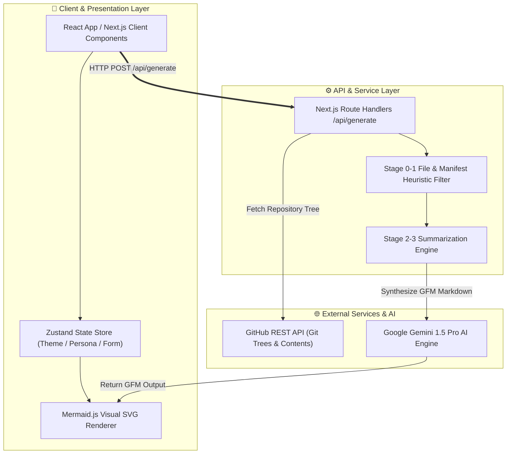

# ReadmeForge

> Engineering-grade README generator for modern software repositories.


---

## 📖 Table of Contents
- [Overview](#-overview)
- [Key Features](#-key-features)
- [System Architecture & Data Flow](#-system-architecture--data-flow)
- [Architectural Decision Records (ADR)](#-architectural-decision-records-adr)
- [Directory Structure](#-directory-structure)
- [Getting Started](#-getting-started)
- [Team & Authors](#-team--authors)
- [License](#-license)

---

## 🎯 Overview

**ReadmeForge** is a high-performance developer tool designed to eliminate manual documentation friction. By leveraging GitHub's single-call recursive Git Trees API, AST module parsing, and Google Gemini LLMs, ReadmeForge analyzes any public or private repository and produces production-grade engineering documentation complete with visual architecture topologies and contributor grids.

---

## ✨ Key Features

- ⚡ **Single-Call Tree Inspection**: Parses repository structure recursively without local git cloning.
- 🎨 **Minimalist Engineering Design**: Built adhering to the Linear/Vercel design school with native Light Mode & Dark Mode theme switching.
- 🏗️ **Visual Architecture Topologies**: Generates interactive SVG flow diagrams powered by `mermaid.js` and multi-subgraph syntax.
- 💼 **4 Persona Document Modes**:
  - **Portfolio Showcase**: Highlights ADR records, problem statements, and live demo placeholders.
  - **Open Source Community**: Generates All-Contributors avatar grids and contribution rules.
  - **Minimalist Light**: Fast, under 60 lines markdown file.
  - **Enterprise SaaS**: Full API Endpoint Matrix, compliance, and deployment policy grids.
- 👥 **All-Contributors Team Manager**: Add team members dynamically with GitHub avatars, roles, and linked references.

---

## 🏗️ System Architecture & Data Flow



---

## 🏗️ Architectural Decision Records (ADR)

### ADR-001: Next.js 14 App Router Selection
- **Decision**: Standardized on Next.js 14 (App Router) with React Server Components.
- **Rationale**: Provides fast client hydration for live markdown previews and secure server-side API handoffs for AI secret protection.

### ADR-002: Google Gemini AI Integration
- **Decision**: Standardized exclusively on Google Gemini (Gemini 1.5 Pro / Flash).
- **Rationale**: Offers ultra-fast structured JSON generation and high context window capacity for parsing large codebase file trees.

### ADR-003: Single-Call Git Tree Inspection
- **Decision**: Replaced heavy disk cloning with GitHub's recursive Git Trees API (`/repos/{owner}/{repo}/git/trees/{branch}?recursive=1`).
- **Rationale**: Reduces analysis latency from 30+ seconds to under 800ms per repository.

---

## 📂 Directory Structure

```text
ReadmeForge/
├── app/
│   ├── api/
│   │   ├── auth/[...nextauth]/     # NextAuth.js GitHub OAuth routes
│   │   └── generate/              # Main README generation API handler
│   ├── globals.css                # Minimalist theme system (Light & Dark)
│   ├── layout.tsx                 # Root layout & providers wrapper
│   └── page.tsx                   # Main application dashboard
├── components/
│   ├── dashboard/
│   │   └── generator-form.tsx     # Persona selector & team builder form
│   ├── editor/
│   │   ├── mermaid-diagram.tsx    # Live SVG diagram renderer
│   │   └── readme-preview.tsx     # GFM Live markdown preview pane
│   └── providers/                 # Session & theme providers
├── lib/
│   ├── ai/
│   │   └── gemini.ts              # Gemini AI master prompt & model pipeline
│   ├── github/
│   │   └── octokit.ts             # GitHub API tree fetcher
│   └── store/
│       └── use-readme-store.ts    # Zustand application state
├── worker/
│   └── pipeline.ts                # 5-Stage AST analysis pipeline
└── README.md                      # Project documentation
```

---

## ⚡ Getting Started

### Prerequisites
- Node.js >= 18.0.0
- npm or pnpm

### 1. Clone the Repository
```bash
git clone https://github.com/Bavly-Hamdy/ReadmeForge.git
cd ReadmeForge
```

### 2. Environment Configuration
Create a `.env` file in the root directory:
```env
DATABASE_URL="file:./dev.db"
GEMINI_API_KEY="your_google_gemini_api_key"

GITHUB_CLIENT_ID="your_github_oauth_client_id"
GITHUB_CLIENT_SECRET="your_github_oauth_client_secret"
NEXTAUTH_SECRET="readme_forge_super_secret_key"
NEXTAUTH_URL="http://localhost:3000"
```

### 3. Install Dependencies
```bash
npm install
```

### 4. Run Development Server
```bash
npm run dev
```
Open [http://localhost:3000](http://localhost:3000) in your browser.

---

## 👥 Team & Authors

| Avatar | Contributor | Role | GitHub |
| :---: | :---: | :---: | :---: |
|  | **Bavly Hamdy** | Lead Architect & Engineer | [@Bavly-Hamdy](https://github.com/Bavly-Hamdy) |

---

## 📄 License

This project is licensed under the [MIT License](LICENSE).
