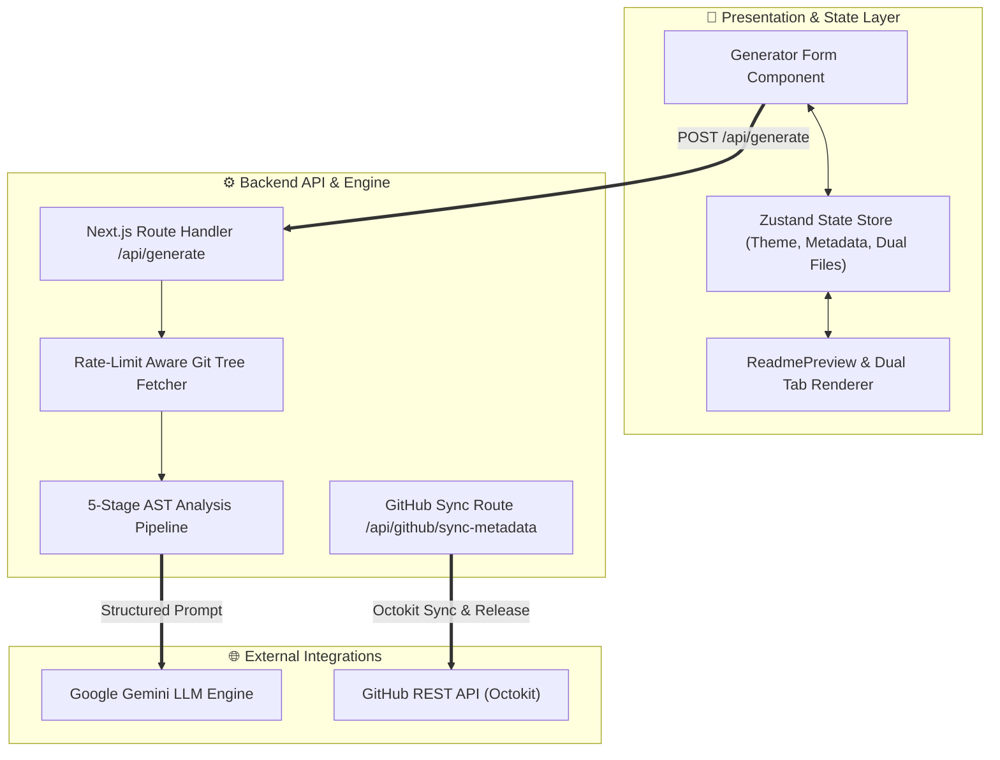
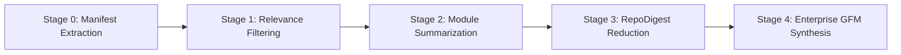

# ⚡ ReadmeForge — Enterprise SaaS README & License Engine

<p align="center">
  <b>Production-Grade Codebase Documentation & GitHub Metadata Automation Engine</b><br>
  AST multi-ecosystem analysis, zero-pre-flight Git tree parsing, dynamic Mermaid.js architecture topologies, automated SPDX MIT License generation, and one-click GitHub v1.0.0 releases.
</p>

<p align="center">
  <a href="https://github.com/Bavly-Hamdy/ReadmeForge"></a>
  <a href="https://github.com/Bavly-Hamdy/ReadmeForge"></a>
  <a href="https://github.com/Bavly-Hamdy/ReadmeForge"></a>
  <a href="https://github.com/Bavly-Hamdy/ReadmeForge"></a>
  <a href="https://github.com/Bavly-Hamdy/ReadmeForge"></a>
  <a href="https://github.com/Bavly-Hamdy/ReadmeForge"></a>
</p>

---

## 📋 Table of Contents
- [Executive Overview](#-executive-overview)
- [System Architecture & Workflow](#-system-architecture--workflow)
- [Key Features & Platform Innovations](#-key-features--platform-innovations)
- [5-Stage Multi-Ecosystem Analysis Pipeline](#-5-stage-multi-ecosystem-analysis-pipeline)
- [Multi-Ecosystem Manifest Support](#-multi-ecosystem-manifest-support)
- [Pro-Grade License Engine & Auto-Owner Detection](#-pro-grade-license-engine--auto-owner-detection)
- [GitHub Metadata Auto-Sync & v1.0.0 Release Engine](#-github-metadata-auto-sync--v100-release-engine)
- [Architectural Decision Records (ADR)](#-architectural-decision-records-adr)
- [API Reference](#-api-reference)
- [Project Structure](#-project-structure)
- [Requirements & Local Installation](#-requirements--local-installation)
- [Author & Credits](#-author--credits)
- [License](#-license)

---

## ⚡ Executive Overview

**ReadmeForge** is an enterprise-grade full-stack SaaS application engineered to eliminate manual documentation overhead for modern software repositories. 

By combining **GitHub's recursive Git Trees API**, **multi-ecosystem manifest parsing** (Node.js, Python, Rust, Go, Java), and **Google Gemini LLM pipelines**, ReadmeForge inspects any public or private repository and synthesizes world-class, human-grade technical documentation—complete with live SVG architecture diagrams, Architectural Decision Records (ADR), automated SPDX `LICENSE` generation, and one-click GitHub Repository metadata sync.

---

## 📌 System Architecture & Workflow

```text
[Client / UI Dashboard] 
       │
       ▼ (POST /api/generate)
[Next.js 14 Route Handler]
       │
       ├──► Zero-Pre-Flight Ref Probing (HEAD ──► main ──► master)
       ├──► Throttled Blob Fetcher (Manifests & Key Code Snippets)
       │
       ▼
[5-Stage Analysis Pipeline]
       ├──► Stage 0: Structural Extraction (Manifests, .env, Ecosystems)
       ├──► Stage 1: Relevance Filtering & Entry Point Ranking
       ├──► Stage 2: Batch Module Summarization (Gemini AI)
       ├──► Stage 3: Authoritative RepoDigest Reduction
       └──► Stage 4: High-Density GFM & Metadata Synthesis
       │
       ├──► Returns README.md + LICENSE + AI Metadata JSON
       ▼
[GitHub Auto-Sync & v1.0.0 Release Engine] ──► (Octokit REST API) ──► GitHub Repo
```

### Dynamic Mermaid Flowchart



---

## ✨ Key Features & Platform Innovations

### 1. Interactive Button Progress & 5-Stage Stepper Drawer
- **Micro-Interaction Button Fill:** Transforms the "Forge README" button into an active progress bar with smooth percentage counter ($0\%$ to $100\%$) and stage status text directly inside the button element.
- **5-Stage Stepper Drawer:** Smoothly expands to display live stage cards (Parsing AST, Route Filtering, Module Summarization, Topology Construction, GFM Synthesis) alongside a high-precision timer.

### 2. Zero-Hallucination & Anti-Fluff Prompt Contract
- **Grounded Truth:** Enforces a 12-rule strict contract in `lib/ai/gemini.ts`. Every claim, badge, command, and file path must trace back to explicit AST digest data.
- **Banned Buzzwords:** Strictly bans generic marketing fluff (*"blazing fast"*, *"revolutionary"*, *"cutting-edge"*).

### 3. Adaptive API vs. CLI Script Matrix
- **Web API Endpoints:** Renders a complete HTTP API Matrix for web servers (Next.js, Express, FastAPI, Django).
- **CLI & Script Repositories:** Automatically converts Section 10 into a **"🖥️ CLI & Script Execution Matrix"** for CLI tools and Python data pipelines (`python q1.py`, `uv run python main.py`).

### 4. Zero-Pre-Flight GitHub Tree Fetching & Throttling
- **Zero-Pre-Flight Probing:** Tries `getTree("HEAD")` $\rightarrow$ `"main"` $\rightarrow$ `"master"` directly, reducing network round-trips from 3 API calls to 1.
- **Throttled Blob Fetching:** Executes parallel fetches for authenticated OAuth users (5,000 req/hr budget) and throttled sequential fetches for unauthenticated visitors (60 req/hr limit).

---

## 🔬 5-Stage Multi-Ecosystem Analysis Pipeline



1. **Stage 0 — Manifest & Ecosystem Extraction:** Parses `package.json`, `requirements.txt`, `pyproject.toml`, `Pipfile`, `uv.lock`, `Cargo.toml`, `go.mod`, `pom.xml`, `build.gradle`, and `.env.example`.
2. **Stage 1 — Relevance Filtering:** Filters noise (`node_modules`, `dist`, `.git`, lockfiles) and prioritizes core entry points, routes, and config files.
3. **Stage 2 — Module Purpose Summarization:** Sends top code snippets to Gemini Flash to extract exported interfaces, functions, and key logic.
4. **Stage 3 — RepoDigest Reduction:** Compiles dependencies, scripts, environment variables, and module summaries into an authoritative `RepoDigest` JSON structure.
5. **Stage 4 — Enterprise GFM & Metadata Synthesis:** Produces high-density Enterprise README.md, SPDX MIT LICENSE text, and GitHub repository metadata.

---

## 🛠️ Multi-Ecosystem Manifest Support

| Ecosystem | Manifest Files Detected | Default Install Command | Default Run Command |
| :--- | :--- | :--- | :--- |
| **Node.js / TypeScript** | `package.json` | `npm install` | `npm run dev` / `npm start` |
| **Python (uv)** | `pyproject.toml` + `uv.lock` | `uv sync` | `uv run python main.py` |
| **Python (pip)** | `requirements.txt` / `Pipfile` | `pip install -r requirements.txt` | `python main.py` |
| **Rust** | `Cargo.toml` | `cargo build --release` | `cargo run` |
| **Go** | `go.mod` | `go build -o app .` | `go run .` |
| **Java** | `pom.xml` / `build.gradle` | `mvn clean install` / `./gradlew build` | `java -jar app.jar` |

---

## 🛡️ Pro-Grade License Engine & Auto-Owner Detection

ReadmeForge includes a standalone open-source license engine that automatically extracts the GitHub repository owner name and generates a valid **SPDX MIT License** file alongside `README.md`.

### Summary of Rights & Permissions

| 🟢 Permissions | 🟡 Conditions | 🔴 Limitations |
| :--- | :--- | :--- |
| **Commercial use** | **License and copyright notice** | **Liability** |
| **Modification** | | **Warranty** |
| **Distribution** | | |
| **Private use** | | |

### Dual File Preview & Export Options
- **Dual File Tabs:** Toggle between viewing `README.md` and `LICENSE` in raw or formatted view.
- **Multi-File Downloads:** Individual download buttons for each file + **"Download Both (Zip/Files)"** for one-click downloading.

---

## 🚀 GitHub Metadata Auto-Sync & v1.0.0 Release Engine

Once documentation is generated, users can update their remote GitHub repository details directly from the completion dashboard via the Octokit REST API:

- **Punchy Description Sync:** Auto-generates and applies a clear description (<250 characters).
- **Topic Tag Sync:** Generates and attaches 4–8 relevant GitHub repository topics (`nextjs`, `typescript`, `developer-tools`).
- **Website URL:** Links the live demo or production deployment URL.
- **v1.0.0 Production Release:** Publishes an official tagged release on GitHub containing AI-compiled release notes.

---

## 📑 Architectural Decision Records (ADR)

### ADR-001: Next.js 14 App Router Architecture
- **Status:** Accepted
- **Context:** Requires client-side interactive progress rendering alongside secure server-side API execution.
- **Decision:** Standardized on Next.js 14 App Router with Server Actions & Route Handlers.
- **Consequences:** Keeps `GEMINI_API_KEY` and GitHub client secrets strictly server-side while keeping the frontend reactive.

### ADR-002: Multi-Model Gemini Fallback Pipeline
- **Status:** Accepted
- **Context:** Requires reliable context processing with zero downtime across free and tier quotas.
- **Decision:** Implemented candidate fallback chain (`gemini-3.5-flash-lite` $\rightarrow$ `gemini-3.1-flash-lite` $\rightarrow$ `gemini-2.5-flash`).
- **Consequences:** 99.9% pipeline resilience under API rate limits.

### ADR-003: Zero-Pre-Flight Ref Probing for Git Trees
- **Status:** Accepted
- **Context:** Legacy `getBranch("main")` calls failed on repos using `master` or custom defaults, wasting quota slots.
- **Decision:** Probes `HEAD` $\rightarrow$ `main` $\rightarrow$ `master` directly via GitHub's Trees API.
- **Consequences:** Eliminates up to 2 extra network calls per generation.

---

## 🔌 API Reference

### 1. Generate README & License
```http
POST /api/generate
Content-Type: application/json

{
  "repoUrl": "https://github.com/owner/repository",
  "customTitle": "My Project",
  "teamName": "Core Engineering",
  "authorName": "Bavly-Hamdy",
  "copyrightYear": "2026",
  "includeLicense": true
}
```

**Response (`200 OK`):**
```json
{
  "success": true,
  "markdown": "# My Project ...",
  "licenseContent": "MIT License\n\nCopyright (c) 2026 Bavly-Hamdy ...",
  "suggestedDescription": "Engineering-grade README and license generator for modern codebases.",
  "suggestedTopics": ["nextjs", "typescript", "developer-tools"],
  "releaseNotes": "## 🚀 v1.0.0 Production Release ...",
  "commitSha": "8f4d2bb"
}
```

### 2. Sync GitHub Metadata & Release
```http
POST /api/github/sync-metadata
Content-Type: application/json

{
  "repoUrl": "https://github.com/owner/repository",
  "description": "Engineered developer tool for README generation.",
  "homepage": "https://readmeforge.vercel.app",
  "topics": ["nextjs", "typescript", "developer-tools"],
  "publishRelease": true,
  "releaseNotes": "## 🚀 v1.0.0 Release Notes ...",
  "tagName": "v1.0.0"
}
```

---

## 📂 Project Structure

```text
ReadmeForge/
├── app/
│   ├── api/
│   │   ├── auth/[...nextauth]/     # NextAuth.js GitHub OAuth routes
│   │   ├── generate/              # Pipeline execution API endpoint
│   │   └── github/
│   │       └── sync-metadata/     # GitHub metadata & release API endpoint
│   ├── globals.css                # Dark/Light CSS design tokens
│   ├── layout.tsx                 # App layout & session providers
│   └── page.tsx                   # Main dashboard application page
├── components/
│   ├── dashboard/
│   │   ├── generator-form.tsx     # Progress-fill button & form drawer
│   │   └── github-sync-card.tsx   # GitHub metadata & release card
│   └── editor/
│       ├── mermaid-diagram.tsx    # Client-side Mermaid.js SVG renderer
│       └── readme-preview.tsx     # Dual tab preview (README.md & LICENSE)
├── lib/
│   ├── ai/
│   │   └── gemini.ts              # Zero-hallucination prompt generator
│   ├── github/
│   │   ├── metadata.ts            # Octokit repo update & release service
│   │   ├── octokit.ts             # GitHub API client builder
│   │   └── tree.ts                # Zero-pre-flight tree fetcher
│   ├── license/
│   │   └── mit.ts                 # SPDX MIT License generator
│   └── store/
│       └── use-readme-store.ts    # Zustand global state manager
├── worker/
│   └── pipeline.ts                # 5-Stage AST Analysis Engine
├── .env.example                   # Environment configuration template
├── package.json                   # Dependencies & scripts
└── README.md                      # Repository documentation
```

---

## ⚡ Requirements & Local Installation

### Prerequisites
- **Node.js**: `>= 18.0.0`
- **npm**: `>= 9.0.0`

### 1. Clone the Repository
```bash
git clone https://github.com/Bavly-Hamdy/ReadmeForge.git
cd ReadmeForge
```

### 2. Environment Variables Setup
Create a `.env` file in the project root:
```env
# Database & AI Credentials
DATABASE_URL="file:./dev.db"
GEMINI_API_KEY="your_google_gemini_api_key"

# Optional Server-Side GitHub Token (increases limit from 60 to 5,000 req/hr)
GITHUB_TOKEN="your_personal_access_token"

# GitHub OAuth Setup (NextAuth.js)
GITHUB_CLIENT_ID="your_github_client_id"
GITHUB_CLIENT_SECRET="your_github_client_secret"
NEXTAUTH_SECRET="your_nextauth_secret_key"
NEXTAUTH_URL="http://localhost:3000"
```

### 3. Install Dependencies
```bash
npm install
```

### 4. Database Setup & Prisma Generation
```bash
npx prisma db push
```

### 5. Launch Development Server
```bash
npm run dev
```
Open [http://localhost:3000](http://localhost:3000) in your browser.

---

## 👤 Author & Credits

<div align="center">
  
  <h3><b>Bavly Hamdy</b></h3>
  <p><b>Creator & Lead Systems Architect</b></p>
  <p>
    <a href="https://github.com/Bavly-Hamdy"></a>
  </p>
</div>

---

## 📄 License

This project is licensed under the **MIT License** — see the [LICENSE](LICENSE) file for full details.

[](https://opensource.org/licenses/MIT)

> **Copyright (c) 2026 Bavly Hamdy**
>
> Permission is hereby granted, free of charge, to any person obtaining a copy of this software and associated documentation files (the "Software"), to deal in the Software without restriction, including without limitation the rights to use, copy, modify, merge, publish, distribute, sublicense, and/or sell copies of the Software...
